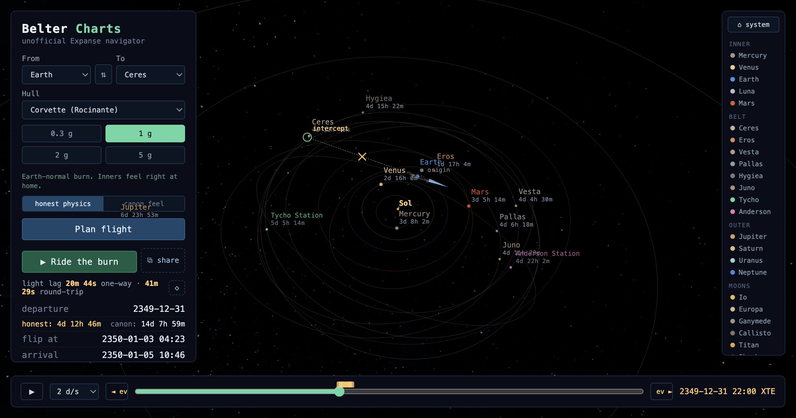

# Belter Charts

Unofficial navigator for The Expanse's solar system. Real ephemerides, canon
locations, Epstein flight planner. Browser-only and no account.

Live at https://belter-charts.pages.dev/.

[](https://belter-charts.pages.dev/?o=earth&d=ceres&hull=corvette&g=1&mode=honest&t=2350-01-01T00%3A00)

**Status: Phase 3 complete — launch-ready** — math core, 3D scene, ride
mode, canon timeline, honesty toggle, shareable plans, about panel (see
Plan.md). Formerly working-titled "Flip and Burn".

## Run

```sh
npm install
npm run dev      # dev server
npm test         # vitest: ephemeris + planner acceptance tests
npm run build    # static build in dist/
```

## Data pipeline

`public/ephem/*.fnb` are packed JPL Horizons state vectors (daily,
2340-2365, heliocentric ecliptic J2000, Float32). Regenerate with:

```sh
npm run fetch-horizons
```

This also refreshes the off-grid spot-check fixtures in
`src/ephemeris/__fixtures__/` that the tests validate against.

Modeling assumptions: [src/data/ASSUMPTIONS.md](src/data/ASSUMPTIONS.md).
Data sources and attributions: [CREDITS.md](CREDITS.md).

## Legal

Unofficial, non-commercial fan work. No show assets. Book-derived proper
nouns are used nominatively. See Plan.md section 12.
